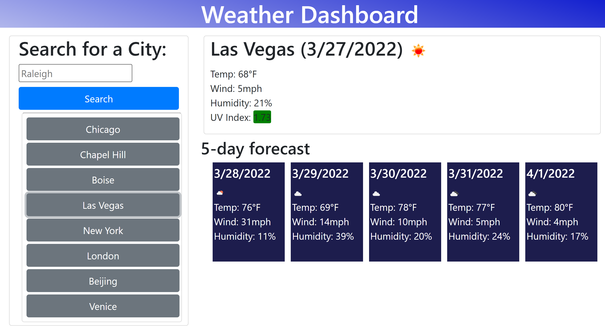

# ZE-Weather-Dashboard

## Purpose

- A weather app that displays current weather and a 5-day forecast for a user chosen city

## Built With

*HTML
*CSS
*JavaScript
*JQuery

## Website

https://zeitel42.github.io/ZE-Weather-Dashboard/

<<<<<<< HEAD

=======

>>>>>>> develop

## Contributions made by Zeitel42
